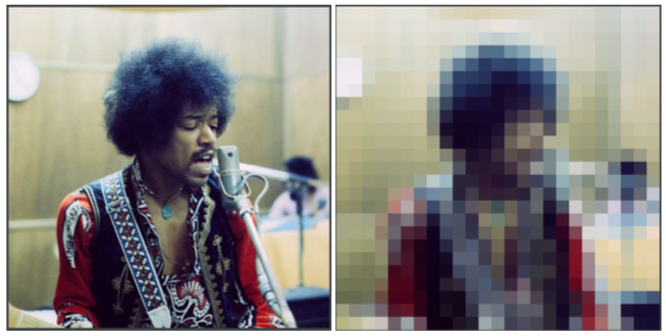
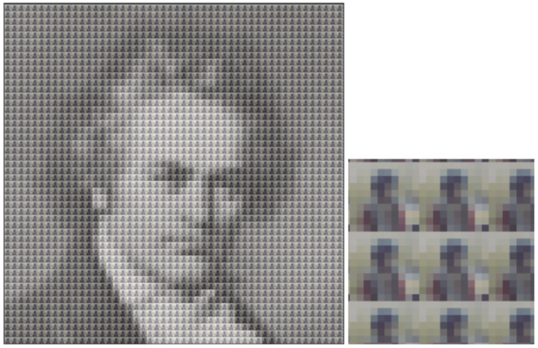
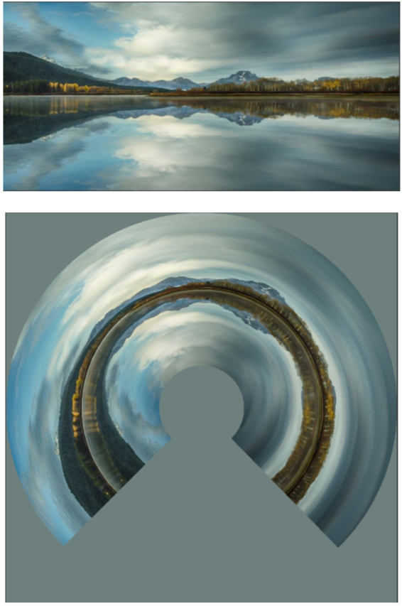

# Image Processing
Bitmap 24 bits file manipulation in C

School project aiming to create bitmap images processed and manipulated given an input image.

## Features
### Simple Paving
The input image is divided in equal blocks, for each block we calculate the average color (pixel RGB channels) and apply it to the blocks of the output file.

### Mosaic
The input image is divided in equal blocks, each block is replaced by the miniaturized input image (or another image of equal size proportions), finally a calculated average color is applied.

### Polarization
The input image Cartesian coordinates are converted to Polar coordinates so the output image is stretched in a circular shape.

#### Comment
For this assignment the files `Img_Bmp_2D.h` and `Img_Bmp_2D.c` have been provided by the teacher. The theoric explanations before this assignment were based upon these two files.
